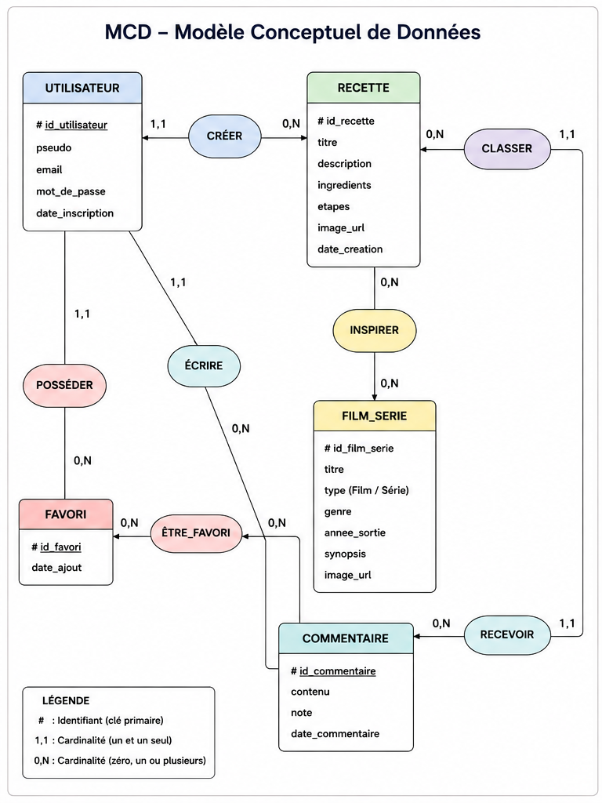

# MCD — Ciné Délices

## Entités

### UTILISATEUR
- id_utilisateur (PK)
- pseudo
- email
- mot_de_passe
- date_inscription

---

### RECETTE
- id_recette (PK)
- titre
- description
- ingredients
- etapes
- image_url
- date_creation

---

### CATEGORIE
- id_categorie (PK)
- nom
- description

---

### FILM_SERIE
- id_film_serie (PK)
- titre
- type (Film / Série)
- genre
- annee_sortie
- synopsis
- image_url

---

### FAVORI
- id_favori (PK)
- date_ajout

---

### COMMENTAIRE
- id_commentaire (PK)
- contenu
- note
- date_commentaire

---

# Relations

## Un utilisateur crée plusieurs recettes
UTILISATEUR (1,1) ---- créer ---- (0,N) RECETTE

---

## Une recette appartient à une catégorie
CATEGORIE (1,1) ---- classer ---- (0,N) RECETTE

---

## Une recette peut être inspirée de plusieurs films/séries
RECETTE (0,N) ---- inspirer ---- (0,N) FILM_SERIE

---

## Un utilisateur peut mettre plusieurs recettes en favori
UTILISATEUR (1,1) ---- posséder ---- (0,N) FAVORI
RECETTE (1,1) ---- être_favori ---- (0,N) FAVORI

---

## Un utilisateur peut commenter plusieurs recettes
UTILISATEUR (1,1) ---- écrire ---- (0,N) COMMENTAIRE
RECETTE (1,1) ---- recevoir ---- (0,N) COMMENTAIRE

